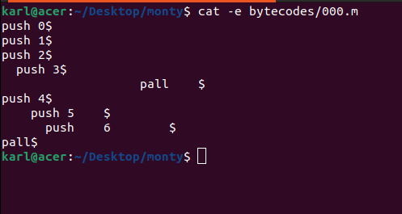
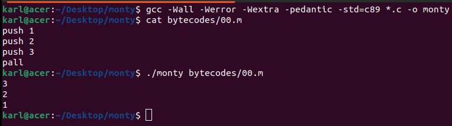

# Monty Interpreter - 0x19. C - Stacks, Queues - LIFO, FIFO

Monty 0.98 is a scripting language that is first compiled into Monty byte codes (Just like Python). It relies on a unique stack, with specific instructions to manipulate it. The goal of this project is to create an interpreter for Monty ByteCodes files.

### Monty byte code files

Files containing Monty byte codes usually have the .m extension. Most of the industry uses this standard but it is not required by the specification of the language. There is not more than one instruction per line. There can be any number of spaces before or after the opcode and its argument:

In this project we are going to design a Monty command interpreter to manipulate stacks and queues. It was developed as part of ALX Software Engineering journey.

## Installation

To use Monty, follow these steps:

1. Clone the repository from GitHub:

<pre>
git clone https://github.com/GDev-Karl/monty.git
</pre>

2. Navigate to the project directory:

<prev> cd monty </prev>

3. Compile the source code:

<prev> gcc -Wall -Werror -Wextra -pedantic -std=c89 *.c -o monty </prev>

## Usage

Monty supports the execution of Monty command files with the .m extension and the name of the file must be a number for example 12.m, 09.m. To run a Monty file, use the following command:

<prev> ./monty path_to_the_file.m </prev>

The .m file should contain opcodes, with each opcode on a separate line. Opcodes are specific commands to manipulate stacks and queues, for example:

    push 2: Adds the element 2 to the stack.
    pall: Displays all elements in the stack.
    pint: Displays the value at the top of the stack.
    mul: Multiplies the top two elements of the stack.

Make sure to follow the syntax and case of the commands.

## Examples

Here is an example of using Monty:

## Available Commands

Monty supports a variety of commands for manipulating stacks and queues. Here are some of the available commands:

    push: Adds an element to the stack.
    pall: Displays all elements in the stack.
    pint: Displays the value at the top of the stack.
    mul: Multiplies the top two elements of the stack.
    mod: Computes the remainder of dividing the top two elements of the stack.
    swap: Swaps the top two elements of the stack.
    pop: Removes the top element from the stack.

Refer to the source code for a complete list of supported commands.

## Authors

### Karl(Me) -> https://github.com/GDev-Karl
### Wisdom -> https://github.com/Echewis